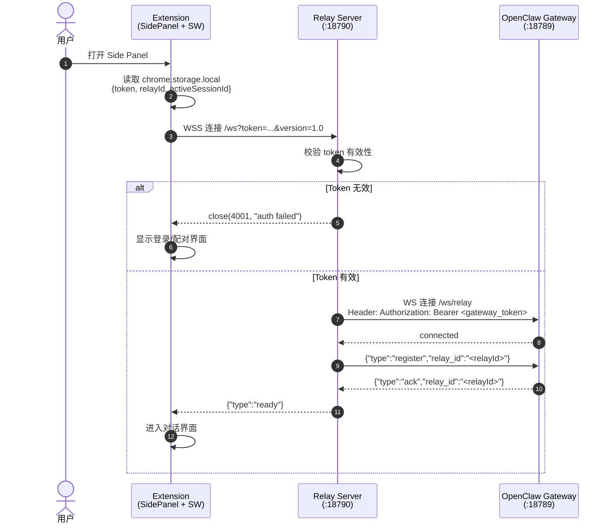
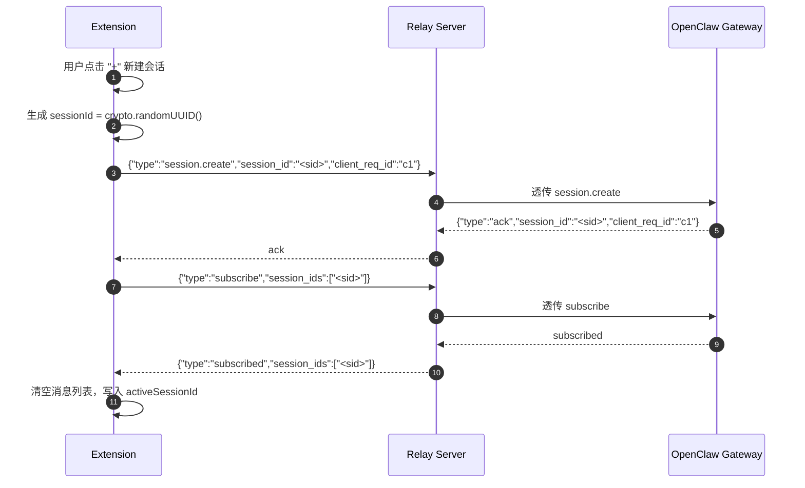
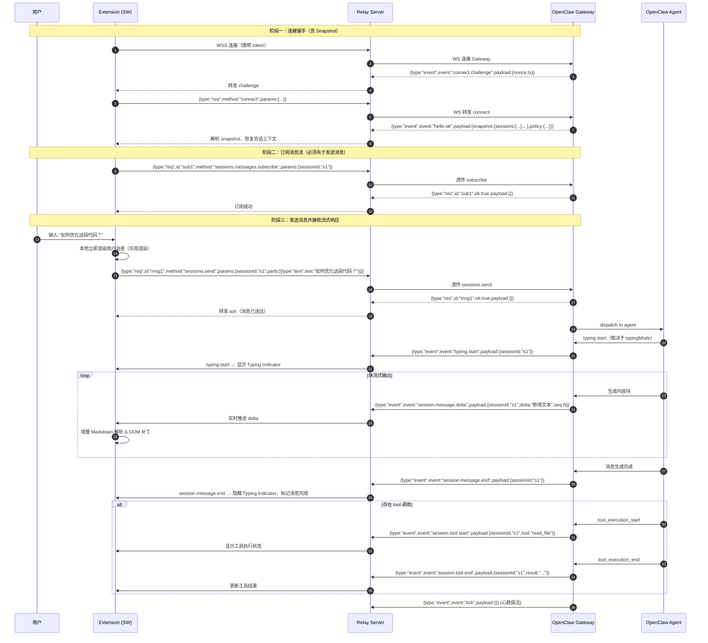
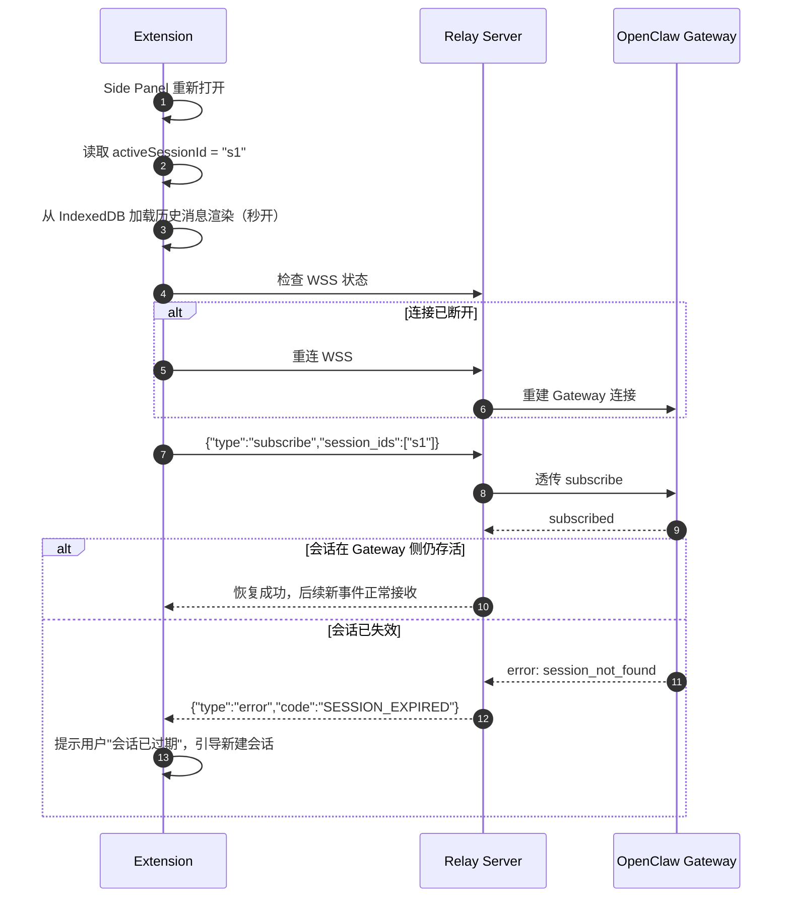
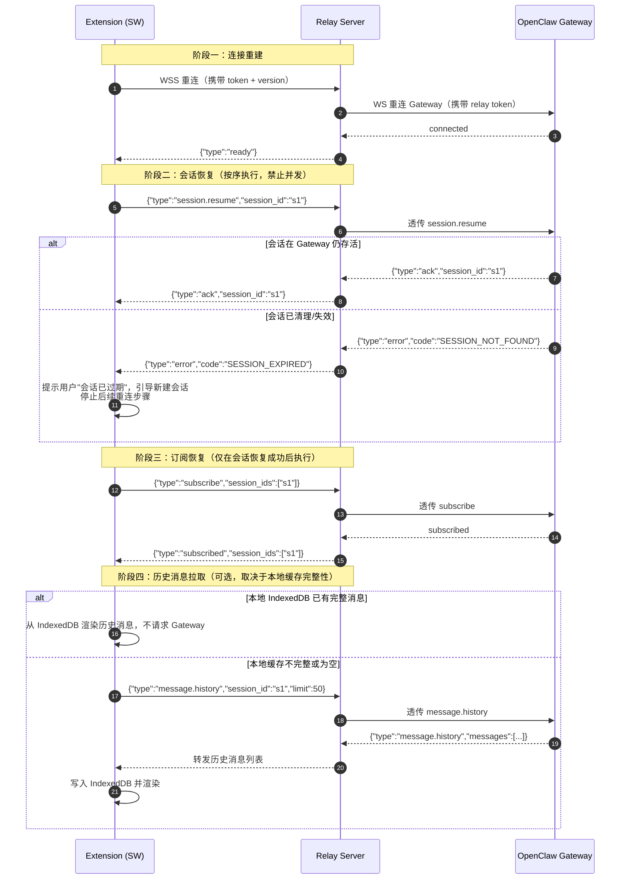

# Chrome Sidebar for OpenClaw — 技术文档

> 版本：v1.0  
> 日期：2026-04-25  
> 状态：架构设计确认 / 待开发  

---

## 1. 概述

本文档定义 **OpenClaw Sidebar Chrome Extension** 及配套 **Relay Server** 的完整技术实现方案。目标是在不暴露 OpenClaw Gateway 内部端口（`loopback:18789`）的前提下，通过 Relay 中继实现 Extension 与 Gateway 的实时 WebSocket 连接，并支持真流式（块模式）输出、会话恢复、Typing Indicator 等高级特性。

---

## 2. 总体架构设计

### 2.1 架构全景

```
┌─────────────────────────────────────────────────────────────────────────────┐
│                              用户侧（MacBook）                                │
│  ┌─────────────────────────────────────────────────────────────────────┐   │
│  │                     Chrome Browser                                  │   │
│  │  ┌──────────────┐         ┌──────────────┐         ┌────────────┐  │   │
│  │  │  Side Panel  │◄───────►│ Service      │◄───────►│  Content   │  │   │
│  │  │  (UI)        │  msg    │ Worker       │  WS     │  Script    │  │   │
│  │  │  React/Vue   │         │ (Conn Mgr)   │         │  (可选)     │  │   │
│  │  └──────────────┘         └──────┬───────┘         └────────────┘  │   │
│  └──────────────────────────────────┼─────────────────────────────────┘   │
│                                     │ WSS (TLS)                           │
└─────────────────────────────────────┼─────────────────────────────────────┘
                                      │
                                      ▼
┌─────────────────────────────────────────────────────────────────────────────┐
│                         阿里云服务器（Linux）                                │
│  ┌─────────────────────────────┐         ┌─────────────────────────────┐   │
│  │      Relay Server           │         │   Nginx / Caddy             │   │
│  │  (Node.js / Deno / Go)      │◄───────►│   (可选，TLS 终结)           │   │
│  │  • 端口: 18790               │  loopback│   • 端口: 18790 (公网)       │   │
│  │  • WS 协议翻译               │         │                             │   │
│  │  • 认证与鉴权                │         └─────────────────────────────┘   │
│  │  • 连接保活 / 重连调度        │                                          │
│  └──────────────┬──────────────┘                                          │
│                 │ WS (本地回环)                                             │
│                 ▼                                                          │
│  ┌─────────────────────────────┐                                          │
│  │   OpenClaw Gateway          │                                          │
│  │  • 绑定: 127.0.0.1:18789     │                                          │
│  │  • 不暴露公网                │                                          │
│  └─────────────────────────────┘                                          │
└─────────────────────────────────────────────────────────────────────────────┘
```

### 2.2 为什么需要 Relay Server

| 约束 | 说明 |
|------|------|
| Gateway 不暴露公网 | 当前 Gateway 绑定 `loopback:18789`，仅本机可访问 |
| 端口限制 | 阿里云安全组目前仅放行 **18790** |
| 安全要求 | Gateway 的 WebSocket 接口直接暴露公网风险过高（无内置 WSS、无 rate limit） |
| 协议差异 | Extension（浏览器）与 Gateway（Node.js ws）在认证头、CORS、心跳策略上存在差异 |

Relay Server 职责：
1. **TLS 终结**：18790 对外提供 WSS，内部转 WS 连 Gateway。
2. **认证代理**：校验 Extension Token，通过后携带 Gateway Token 连接 `/ws/relay`。
3. **协议适配**：将 Extension 的 JSON 消息格式与 Gateway 的 relay 协议对齐。
4. **会话订阅管理**：维护 Extension → Session 的映射，断连时自动清理。
5. **可观测性**：统一生成 `request_id`，记录连接生命周期与消息流量。

### 2.3 可迭代架构原则

- **插件化设计**：Relay Server 的消息处理器采用中间件（Middleware）链，定义如下注册接口：

```typescript
// src/relay/protocol.ts
type Middleware = (msg: ExtMessage, ctx: RelayContext) => ExtMessage | null;

// 注册新中间件（按顺序执行）
function registerMiddleware(m: Middleware, order: 'pre' | 'post'): void;

// 示例：注册一个日志中间件
registerMiddleware(async (msg, ctx) => {
  ctx.logger.info({ type: msg.type, sessionId: msg.session_id }, 'Incoming message');
  return msg; // 返回 null 表示截断，不再往下传递
}, 'pre');
```

当需要支持新的协议字段（如 `tool_use` 事件）时，无需修改核心转发逻辑，只需注册一个新中间件即可。

- **配置热更新**：Relay Server 支持两种热更新策略，通过 `config.hotReloadStrategy` 配置：
  - `reload`（默认）：收到 SIGHUP 后，监听新连接使用新配置，已连接 Extension 保持旧配置直到断连。适合轻微配置变更（如日志级别调整）。
  - `graceful`：收到 SIGHUP 后，所有已连接 Extension 立即断开并重连，新配置对所有连接生效。适合重大变更（如认证规则修改）。

  **注意**：热更新**不断开** Relay 与 Gateway 之间的连接，因为 Gateway 侧无感知。

- **版本协商**：Extension 连接时携带 `x-client-version`（如 `1.0.0`），Relay 根据版本路由到不同协议适配器。协商规则：
  - Relay 支持的最小版本 `minVersion` 与最大版本 `maxVersion` 在配置中定义。
  - 若 Extension 版本 < `minVersion`：拒绝连接，返回 `close(4003, "unsupported client version")`。
  - 若 Extension 版本 > `maxVersion`：Relay 尝试用最高版本协议处理，Extension 必须能够接受降级响应。
  - 版本兼容策略：同主版本号（如 `1.x.y`）内协议兼容；跨主版本号（如 `1.x` vs `2.x`）必须显式声明。

- **Gateway 无侵入**：Relay 作为独立进程运行，Gateway 无需任何改动即可接入。

---

## 3. 技术栈选型

| 层级 | 选型 | 理由 |
|------|------|------|
| Extension UI | React 18 + TypeScript | 组件化、生态成熟、类型安全 |
| Extension 构建 | Vite + CRXJS | 极速 HMR，原生支持 Manifest V3 |
| Extension 存储 | `chrome.storage.local` + IndexedDB | 会话数据量大时用 IndexedDB 存消息体 |
| Markdown 渲染 | `react-markdown` + `remark-gfm` + `rehype-highlight` | 支持 GFM 与语法高亮 |
| Relay Server | Node.js 22 + `ws` + `fastify` | 与 Gateway 同技术栈，便于维护；`fastify` 做 HTTP 管理接口 |
| Relay 进程管理 | `pm2` / `systemd` | 服务器崩溃自启、日志轮转 |
| 反向代理 | Nginx（已有）或 Caddy | TLS 证书管理、WebSocket 透传 |
| 代码规范 | ESLint + Prettier + Husky | 提交前自动格式化与检查 |
| 测试 | Vitest（Extension）+ Node Test Runner（Relay） | 轻量、原生 TS 支持 |

---

## 4. 系统交互时序（真流式块输出）

### 4.1 首次连接与认证



### 4.2 新建会话（session.create）



### 4.3 发送消息与真流式接收（核心时序）

> **⚠️ 以下为基于文档的推测时序**，实际 RPC 方法名、事件名、payload 结构需在开发时通过抓包确认。



**关键设计点**：
1. **必须先订阅再发消息**：`sessions.messages.subscribe` 必须在 `sessions.send` 之前执行，否则会丢失流式事件
2. **乐观渲染**：用户消息在发送前立即本地渲染，不用等 Gateway ack
3. **seq 序列号**：每个 `session.message.delta` 带有 seq，Extension 用它保证顺序（不依赖 delta 到达顺序）
4. **两套订阅**：消息流订阅（`sessions.messages.subscribe`）+ 会话变更订阅（`sessions.subscribe`，用于监听会话切换/创建）
        A->>G: tool_execution_end + result
        G->>R: event: tool_end
        R->>E: 更新工具结果
    end

    A->>G: turn_end
    G->>R: event: turn_end
    R->>E: 本回合结束，输入框恢复可输入
```

### 4.4 会话恢复（Side Panel 重新打开）



#### 本地缓存与服务端状态不一致时的仲裁策略

当 IndexedDB 本地缓存与 Gateway 服务端状态出现分歧时，以**服务端状态为唯一可信来源**：

| 场景 | 判断依据 | 处理流程 |
|------|----------|----------|
| 本地有 `activeSessionId`，Gateway 返回 `SESSION_NOT_FOUND` | Gateway 是会话的权威宿主 | 接受失效判定，清除本地 `activeSessionId` 和 `sessionMetaList` 中对应记录，提示用户 |
| 本地有消息但 Gateway 会话仍活跃，但消息时间戳早于 Gateway 的会话创建时间 | Gateway 按需维护会话窗口 | 以 Gateway 历史消息为准，本地过时的消息直接丢弃，不做合并 |
| 本地无缓存（首次打开或缓存被清除），Gateway 会话仍活跃 | — | 通过 `message.history` 拉取完整历史消息，写入 IndexedDB 再渲染 |
| 网络断开，无法询问 Gateway（离线场景） | Extension 侧无法确认状态 | 显示"当前处于离线模式"，允许用户浏览本地已缓存消息，但禁止发送新消息 |

**仲裁原则**：`chrome.storage.local` 中的 `activeSessionId` 只是加速"秒开"的临时缓存，不代表会话在 Gateway 侧一定有效。所有会话级操作（subscribe、message.send）的最终结果以 Gateway 响应为准。

---

## 5. Relay Server 详细设计

### 5.1 模块结构

```
relay-server/
├── src/
│   ├── main.ts                 # 入口，启动 HTTP + WS 服务器
│   ├── config.ts               # 配置加载（端口、TLS、Gateway 地址、Token 映射）
│   ├── logger.ts               # Pino 结构化日志
│   ├── server/
│   │   ├── http.ts             # Fastify HTTP 管理接口（/health, /metrics）
│   │   └── websocket.ts        # WebSocket 服务器（ws 库）
│   ├── relay/
│   │   ├── connection.ts       # Extension ↔ Relay ↔ Gateway 连接管理
│   │   ├── auth.ts             # Token 校验与 Gateway Token 映射
│   │   ├── protocol.ts         # 消息协议适配与版本路由
│   │   ├── session.ts          # 会话订阅状态管理
│   │   └── heartbeat.ts        # 双向心跳与保活
│   └── types/
│       └── index.ts            # 共享类型定义
├── tests/
├── ecosystem.config.js         # PM2 配置
├── Dockerfile
└── package.json
```

### 5.2 核心类型定义

> **⚠️ 协议说明**：OpenClaw Gateway 使用 RPC + 事件推送双模式，与典型的 Simple-{type} 协议不同。实际字段需在开发过程中通过抓包验证，以下为基于文档的推测结构。

#### 5.2.1 Gateway → Relay → Extension 帧格式（基于 protocol.md）

OpenClaw Gateway 定义三种帧：

```typescript
// Request：Extension → Gateway（经 Relay 透传）
interface GatewayRequest {
  type: "req";
  id: string;                    // 请求唯一 ID，用于匹配 Response
  method: string;                // RPC 方法名，如 "sessions.send"、"sessions.subscribe"
  params: object;                // 方法参数
}

// Response：Gateway → Extension（经 Relay 透传）
interface GatewayResponse {
  type: "res";
  id: string;                    // 对应 Request 的 id
  ok: boolean;                   // true=成功，false=失败
  payload?: object;              // 成功时的返回值
  error?: { code: string; message: string };  // 失败时的错误信息
}

// Event：Gateway → Extension（经 Relay 透传，事件推送）
interface GatewayEvent {
  type: "event";
  event: string;                 // 事件名，如 "session.message"、"session.tool"、"typing.start"
  payload: object;               // 事件数据
  seq?: number;                  // 序列号，保证顺序
  stateVersion?: string;          // 状态版本，用于快照同步
}
```

#### 5.2.2 Extension → Relay → Gateway 消息（推测，供参考）

Relay 连接 Gateway 时使用的 RPC 方法（基于 protocol.md 的 Session 相关方法）：

| Extension 动作 | 对应 RPC method | params 推测 |
|----------------|----------------|-------------|
| 创建会话 | `sessions.create` | `{ sessionId?: string; deliver?: boolean }` |
| 发送消息 | `sessions.send` | `{ sessionId: string; parts: MessagePart[] }` |
| 订阅会话变更事件 | `sessions.subscribe` | `{ sessionId: string }` |
| 订阅消息流事件 | `sessions.messages.subscribe` | `{ sessionId: string }` |
| 取消订阅 | `sessions.unsubscribe` | `{ sessionId: string }` |

#### 5.2.3 核心事件类型（基于文档推测）

```typescript
// 流式输出相关事件（session.message 事件族，实际事件名需开发时确认）
type StreamingEvent =
  | 'session.message.start'    // 流式消息开始（首个可见内容块）
  | 'session.message.delta'    // 流式内容块（delta 增量）
  | 'session.message.end'      // 流式消息结束
  | 'session.tool.start'       // 工具执行开始
  | 'session.tool.delta'       // 工具执行输出
  | 'session.tool.end';        // 工具执行结束

// typing indicator 相关事件（基于 typing-indicators 文档）
type TypingEvent =
  | 'typing.start'             // 开始显示 typing indicator
  | 'typing.end';              // 停止显示 typing indicator

// 会话相关事件
type SessionEvent =
  | 'sessions.changed'         // 会话列表变更（创建/删除/修改）
  | 'session.message';         // 消息/转录事件流

// 系统事件
type SystemEvent =
  | 'tick'                     // 心跳保活（15s 间隔，由 policy.tickIntervalMs 定义）
  | 'heartbeat'                // 心跳响应
  | 'hello-ok'                  // 连接握手成功（含 snapshot 快照）
  | 'shutdown';                 // Gateway 关闭通知
```

#### 5.2.4 Snapshot Streaming（连接握手快照）

`hello-ok` 事件携带 `snapshot` 字段，是连接建立时的完整状态快照：

```typescript
interface HelloOkEvent {
  type: "event";
  event: "hello-ok";
  payload: {
    protocolVersion: string;
    serverInfo: object;
    features: string[];
    snapshot: {
      sessions: Session[];        // 当前活跃会话列表
      presence: PresenceEntry[]; // 当前在线用户列表
    };
    policy: {
      maxPayload: number;        // 最大帧大小（默认 26214400 bytes）
      maxBufferedBytes: number;  // 最大缓冲字节
      tickIntervalMs: number;    // 心跳间隔（默认 15000 ms）
    };
  };
}
```

**处理逻辑**：Extension 连接时，先接收并解析 `snapshot`，恢复当前上下文；之后再通过事件流增量更新。

#### 5.2.5 两套订阅机制

OpenClaw 的订阅分为两个独立维度，**必须同时订阅**才能实现完整流式输出：

```typescript
// 会话级订阅：监听 sessions.changed（会话创建/删除/状态变更）
// 对应 RPC: sessions.subscribe({ sessionId })
// 触发时机：新建会话、切换会话、删除会话时

// 消息级订阅：监听 session.message / session.tool（消息内容流式事件）
// 对应 RPC: sessions.messages.subscribe({ sessionId })
// 触发时机：每次收到流式输出块时

// 订阅时序（必须先建立消息级订阅，再发送消息）：
// 1. sessions.messages.subscribe(sessionId)  → 建立消息流订阅
// 2. sessions.send(sessionId, { parts })     → 发送消息，触发流式输出
// 3. 收到 session.message.delta 流式块       → 实时渲染
// 4. session.message.end                     → 流式结束
```

#### 5.2.6 Relay → Extension 消息（Relay 根据 Gateway 帧转换后）

Relay 在转发时将 Gateway 的帧格式转换为 Extension 友好的格式：

```typescript
// Relay → Extension 的消息统一格式（简化处理）
interface RelayMessage {
  type: 'req' | 'res' | 'event';  // 透传 Gateway 帧类型
  requestId: string;             // 对应 Gateway 的 id/seq
  method?: string;                // req 时有
  eventType?: string;             // event 时有（对应 Gateway event）
  payload: object;                // 透传或转换后的数据
  ok?: boolean;                   // res 时有
  error?: { code: string; message: string };  // res 时有
}
```

> **⚠️ 重要**：以上类型定义为基于文档的**推测**，实际协议字段（如 `session.message.delta` 的 payload 结构、`snapshot.sessions` 的具体 schema）需要在开发过程中通过**抓包或查看 Gateway 源码**确认，并同步更新本文档。
```

### 5.3 连接生命周期状态机

```
[Extension WS]          [Relay]                [Gateway WS]
   IDLE ──connect──►  ACCEPTED ──connect──► CONNECTING
                         │                       │
                         │◄─────ready───────────┘
                         │
                      ACTIVE ◄─────双向转发─────► OPEN
                         │
                    任何一方断开
                         │
                      CLOSING ──cleanup──► CLOSED
                         │
                    指数退避重连（仅 Relay→Gateway）
                         │
                      RECONNECTING
```

### 5.4 心跳策略

| 链路 | 方向 | 间隔 | 超时 | 动作 |
|------|------|------|------|------|
| Extension ↔ Relay | Relay 发 `ping` | 20s | 60s | 未收到 `pong` 则断开 Extension |
| Relay ↔ Gateway | Relay 发 `ping` | 15s | 45s | 未收到 `pong` 则重连 Gateway |

---

## 6. Extension 详细设计

### 6.1 Manifest V3 配置

```json
{
  "manifest_version": 3,
  "name": "OpenClaw Sidebar",
  "version": "1.0.0",
  "permissions": [
    "sidePanel",
    "storage",
    "activeTab"
  ],
  "host_permissions": [
    "wss://your-server:18790/*"
  ],
  "background": {
    "service_worker": "src/background.ts",
    "type": "module"
  },
  "side_panel": {
    "default_path": "sidepanel.html"
  },
  "action": {
    "default_title": "打开 OpenClaw"
  },
  "commands": {
    "open-side-panel": {
      "suggested_key": {
        "default": "Alt+Shift+O"
      },
      "description": "打开/关闭侧边栏"
    }
  },
  "content_security_policy": {
    "extension_pages": "script-src 'self'; object-src 'self'; connect-src 'self' wss://your-server:18790; img-src 'self' https: data:;"
  }
}
```

### 6.2 模块结构

```
extension/
├── src/
│   ├── background/
│   │   ├── index.ts           # Service Worker 入口
│   │   ├── connection.ts      # WebSocket 连接管理（唯一长连接）
│   │   ├── message-router.ts  # 处理 SW 与 Side Panel / Content Script 通信
│   │   └── storage.ts         # chrome.storage 封装
│   ├── sidepanel/
│   │   ├── main.tsx           # React 根组件
│   │   ├── App.tsx            # 主布局
│   │   ├── components/
│   │   │   ├── ChatHeader.tsx
│   │   │   ├── MessageList.tsx
│   │   │   ├── MessageBubble.tsx
│   │   │   ├── MarkdownRenderer.tsx
│   │   │   ├── TypingIndicator.tsx
│   │   │   ├── InputArea.tsx
│   │   │   └── SessionList.tsx
│   │   ├── hooks/
│   │   │   ├── useConnection.ts
│   │   │   ├── useMessages.ts
│   │   │   ├── useSessions.ts
│   │   │   └── useStreaming.ts
│   │   └── stores/
│   │       └── chatStore.ts   # Zustand 状态管理
│   ├── shared/
│   │   ├── types.ts           # 共享类型
│   │   ├── protocol.ts        # 消息协议常量
│   │   └── utils.ts           # 工具函数
│   └── content-script/        # 可选：页面快捷唤起
│       └── index.ts
├── public/
│   └── icons/
├── tests/
├── vite.config.ts
├── tsconfig.json
└── package.json
```

### 6.3 真流式渲染机制

Extension 侧必须实现**增量 Markdown 解析**，避免每次收到块都全量重新渲染导致的闪烁与性能问题。

推荐方案：**基于 seq 序列号的增量补丁**

```typescript
// useStreaming.ts 核心逻辑
// ⚠️ 以下使用文档推测的事件名，实际需在开发时通过抓包确认
function useStreaming(sessionId: string) {
  const [messages, setMessages] = useState<Message[]>([]);
  const pendingBuffer = useRef<Map<string, string>>(new Map()); // sessionId → rawText

  useEffect(() => {
    // 订阅消息流（必须先于 sessions.send 执行）
    const unsub = connection.onGatewayEvent((event) => {
      switch (event.event) {
        case 'hello-ok':
          // 连接握手成功，解析 snapshot，恢复会话上下文
          restoreFromSnapshot(event.payload.snapshot);
          break;

        case 'session.message.start':
          // 创建空消息气泡（seq 用于排序）
          appendEmptyAssistantMessage({ seq: event.seq, sessionId });
          break;

        case 'session.message.delta':
          // 增量追加文本（使用 seq 保证顺序，忽略乱序包）
          const existing = pendingBuffer.current.get(sessionId) ?? '';
          pendingBuffer.current.set(sessionId, existing + event.payload.delta);
          appendDeltaToLastMessage(event.payload.delta, event.seq);
          break;

        case 'session.message.end':
          // 流式结束，finalize 消息
          finalizeLastMessage();
          pendingBuffer.current.delete(sessionId);
          break;

        case 'typing.start':
          if (typingMode !== 'never') showTypingIndicator();
          break;
        case 'typing.end':
          hideTypingIndicator();
          break;
      }
    });
    return unsub;
  }, [sessionId]);
}
```

**关键设计点**：
- **seq 排序**：每个 `session.message.delta` 带 seq，Extension 用它处理乱序（不依赖到达顺序）
- **乐观渲染**：用户消息在 `sessions.send` 前立即渲染，不等 ack
- **pending buffer**：内存中维护每个会话的原始文本 buffer，用于增量追加和 Markdown 解析
- **Markdown 渲染**：使用 `react-markdown` 的 `components` 自定义渲染器，代码块通过 `rehype-highlight` 高亮
- **超长输出优化**：对于超长输出（>5000 tokens），使用虚拟滚动（`react-window` 或 `@tanstack/react-virtual`）

### 6.4 会话存储策略

| 数据 | 存储位置 | 键名 | 说明 |
|------|----------|------|------|
| Token / RelayId | `chrome.storage.local` | `auth` | 加密存储（可选使用 `chrome.storage.session` 提升安全） |
| 活跃会话 ID | `chrome.storage.local` | `activeSessionId` | 重启后恢复 |
| 会话元数据列表 | `chrome.storage.local` | `sessionMetaList` | 最近 50 条会话的标题、ID、时间戳 |
| 消息内容 | IndexedDB | `messages_<sessionId>` | 单条会话消息体，避免 `storage.local` 5MB 限制 |

---

## 7. 异常处理与重连策略

### 7.1 异常分类与处理矩阵

| 异常类型 | 检测点 | Extension 行为 | Relay 行为 |
|----------|--------|----------------|------------|
| 网络闪断 | `ws.onclose` | 指数退避重连（最大 30s），显示"重连中…" | 清理 Extension 映射，保留 Gateway 连接池 |
| Gateway 不可用 | Relay 连 Gateway 失败 | 收到 Relay 下发的 `error: gateway_unavailable` | 对 Gateway 退避重连，缓存 Extension 消息 |
| Token 过期 | Relay 校验失败 | 收到 `close(4001)`，跳转登录页 | 拒绝连接，记录审计日志 |
| 会话不存在 | Gateway 返回 error | 提示"会话已过期"，引导新建 | 透传错误，不干预 |
| 消息发送超时 | 60s 无 ack | 显示"发送失败，点击重试" | 清理 pendingAck，释放资源 |
| 块输出中断 | 收到 `session.message.start` 后 60s 内未收到 `session.message.end` | 60s 后标记"输出不完整"，提供"重试"按钮 | 透传 Gateway 事件，无额外处理 |
| 浏览器休眠唤醒 | `document.visibilitychange` 变为 visible；`chrome.runtime.onStartup` | Extension 在浏览器唤醒后**立即向 Relay 发送 `ping`**，探测连接是否存活：<br>• 若收到 `pong`：说明 SW 存活、连接可用，直接复用，无需重建。<br>• 若 10s 内未收到 `pong` 或 WebSocket 已关闭：执行完整重连握手流程，重新 subscribe 活跃会话。<br>**注意**：浏览器唤醒不等于 Session 在 Gateway 侧仍然有效，重连后若 `subscribe` 返回 `SESSION_EXPIRED`，按会话失效处理。 |
| 快速开关侧边栏 | 用户在 < 2s 内多次打开/关闭 Side Panel | SW 连接管理采用**懒连接模式**：首次打开时建立 WSS 并缓存连接实例，后续打开直接复用。关闭 Side Panel 时**不主动断开连接**，仅清理 Side Panel 的 UI 状态。连续快速开关时，已建立的连接不会被重复创建。 |

### 7.2 指数退避重连算法

```typescript
function getReconnectDelay(attempt: number): number {
  const base = 1000; // 1s
  const max = 30000; // 30s
  const jitter = Math.random() * 1000;
  return Math.min(base * Math.pow(2, attempt), max) + jitter;
}

// 每次重连成功后 attempt 归零
// 最大重试次数：无限（用户可手动点击"停止重试"）
```

### 7.3 Gateway 重启后的完整重连握手时序

当 Relay 检测到 Gateway 连接断开后恢复，或 Extension 因网络闪断重新连接时，按以下顺序恢复会话上下文：



**关键约束**：
- 阶段二（session.resume）与阶段三（subscribe）必须**按序串行执行**，禁止并发。原因：若会话已失效，subscribe 会失败并导致 UI 出现瞬时错误状态。
- Relay 应维护一个"待恢复会话队列"，Gateway 恢复后按 FIFO 顺序逐个恢复。
- Extension 侧在重连过程中应显示"正在恢复会话…"的中间态，而非让用户认为可以立即输入。

### 7.5 Side Panel 生命周期特殊处理

Chrome Side Panel 在关闭时会卸载页面（`beforeunload`），但 Service Worker 保持存活（直到浏览器决定终止）。

- **关闭时**：Side Panel 发送 `saveState` 消息给 SW，SW 将当前输入草稿、滚动位置写入 `storage.local`。
- **打开时**：Side Panel 从 `storage.local` 恢复状态，同时向 SW 请求当前连接状态与未读事件。
- **SW 被浏览器终止后重启**：`chrome.runtime.onStartup` 中读取 `activeSessionId`，若配置了自动重连则立即建立 WSS，否则等待用户打开 Side Panel 时按需连接（lazy connect）。

---

## 8. 安全设计

### 8.1 通信安全

| 链路 | 协议 | 证书 | 备注 |
|------|------|------|------|
| Extension ↔ Relay | WSS | 阿里云服务器域名证书（Let's Encrypt 或阿里云 SSL） | 必须校验域名，禁止自签证书 |
| Relay ↔ Gateway | WS（本地）或 WSS | 如有内网 TLS 则启用 | 建议同机部署，走 `127.0.0.1` |

### 8.2 认证安全

- Extension 持有的 Token 为 **Relay Token**（由 Relay Server 签发，JWT 格式，含 `exp` 与 `relay_id` 声明）。
- Relay Server 持有 **Gateway Token**（从 `openclaw.json` 读取或环境变量注入），绝不泄露给 Extension。
- Token 轮换：Relay Token 有效期 30 天，Extension 在到期前 7 天自动向 Relay 申请刷新（`/v1/refresh` HTTP 接口）。

### 8.3 CSP 与 XSS 防护

- `sidepanel.html` 的 CSP 严格限制 `script-src 'self'`。
- Markdown 渲染禁用原始 HTML（`rehype-raw` 默认关闭）。
- 所有外部链接点击后在新标签页打开，并添加 `rel="noopener noreferrer"`。
- 图片仅允许 `https:` 协议，禁止 `http:` 与 `data:`（用户上传除外）。

---

## 9. 开发流程规范

### 9.1 Git 分支模型（GitHub Flow 简化版）

```
main
  │
  ├── feature/streaming-render      → PR → Review → Merge
  ├── feature/session-restore       → PR → Review → Merge
  ├── fix/reconnect-race            → PR → Review → Merge
  └── release/v1.0.0                → Tag → CI/CD → Deploy
```

- `main` 分支为唯一长期分支，始终可部署。
- 功能开发从 `main` checkout 出 `feature/<name>` 分支。
- 修复从 `main` checkout 出 `fix/<name>` 分支。
- 合并前必须通过 CI（lint + typecheck + test）。
- 提交信息遵循 **Conventional Commits**：
  - `feat:` 新功能
  - `fix:` 修复
  - `refactor:` 重构
  - `docs:` 文档
  - `test:` 测试
  - `chore:` 构建/依赖

### 9.2 CI/CD 集成方案

采用 **GitHub Actions** 双流水线：

#### CI 流水线（每次 PR / Push）

```yaml
# .github/workflows/ci.yml
name: CI
on: [push, pull_request]
jobs:
  lint-type-test:
    runs-on: ubuntu-latest
    steps:
      - uses: actions/checkout@v4
      - uses: actions/setup-node@v4
        with: { node-version: '22' }
      - run: npm ci
      - run: npm run lint        # ESLint
      - run: npm run typecheck   # tsc --noEmit
      - run: npm run test        # Vitest / Node Test Runner
      - run: npm run build       # Vite 构建 Extension + tsc Relay
```

#### CD 流水线（Tag 触发）

```yaml
# .github/workflows/cd.yml
name: CD
on:
  push:
    tags: ['v*']
jobs:
  build-release:
    runs-on: ubuntu-latest
    steps:
      - uses: actions/checkout@v4
      # 1. 构建 Extension zip（供 Chrome Web Store / 手动加载）
      - run: npm ci && npm run build:ext
      - uses: actions/upload-artifact@v4
        with: { name: extension, path: dist/ext.zip }
      # 2. 构建 Relay Docker 镜像
      - run: docker build -t openclaw-relay:${TAG} ./relay-server
      # 3. 推送至阿里云 ACR（或其他镜像仓库）
      - run: docker push registry.cn-hangzhou.aliyuncs.com/xxx/openclaw-relay:${TAG}
      # 4. SSH 到服务器执行滚动更新
      - run: |
          ssh admin@server "cd /opt/openclaw-relay && docker-compose pull && docker-compose up -d"
```

**部署策略**：
- Relay Server 使用 Docker Compose 部署，`docker-compose.yml` 定义 Nginx + Relay 服务。
- 更新时先拉取新镜像，再 `docker-compose up -d`，旧容器由 Docker 自动替换（零停机）。
- Extension 更新通过 Chrome Web Store 发布（或用户手动加载 unpacked）。

### 9.3 代码审查（Code Review）规范

#### 评审维度（必须逐项检查）

| 维度 | 检查项 | 通过标准 |
|------|--------|----------|
| **功能正确性** | 是否满足 PR 描述的需求？边界条件是否处理？ | 测试用例覆盖核心路径与边界 |
| **流式协议** | 块输出是否增量渲染？`session.message.end` 是否正确收尾？seq 乱序是否处理？ | 模拟慢速网络验证不闪烁 |
| **连接稳定性** | 断连重连后会话订阅是否恢复？是否存在竞态？ | 通过 `ws` 强制断连测试 |
| **安全性** | Token 是否硬编码？CSP 是否收紧？XSS 向量是否消除？ | `npm audit` 无高危漏洞 |
| **性能** | 大数据量（>100 条消息）下滚动是否卡顿？内存是否泄漏？ | Chrome DevTools Performance 无长任务 |
| **可观测性** | 新增代码是否包含结构化日志？是否携带 requestId？ | 日志输出到 console 或 Pino |
| **类型安全** | TypeScript 是否 `strict` 通过？是否存在 `any` 滥用？ | `tsc --noEmit` 零报错 |

#### 评审输出格式（PR Review Comment 模板）

```markdown
### 评审结论
- [ ] 批准（Approve）
- [ ] 需修改（Request Changes）
- [ ] 仅评论（Comment）

### 问题清单（如有）
| 位置 | 严重程度 | 说明 | 建议修改 |
|------|----------|------|----------|
| `src/connection.ts:42` | 🔴 Blocker | 重连时未清空 pendingAcks | 在 `ws.onclose` 中清理 |
| `src/Chat.tsx:88` | 🟡 Warning | 使用 `dangerouslySetInnerHTML` | 改用 `react-markdown` |

### 正向反馈
- 心跳退避策略设计合理，考虑了浏览器休眠场景。
```

#### 泛泛而谈的反面示例

| 类型 | ❌ 禁止（泛泛而谈） | ✅ 正确示范 |
|------|---------------------|-------------|
| 功能评价 | "这段逻辑写得不错" | `src/connection.ts:55` — `pendingAcks` 在 `ws.onclose` 中未清理，导致断连重连后请求状态不一致，建议在 `finally` 块中调用 `flushPendingAcks()` |
| 性能评价 | "性能还行" | `src/ChatList.tsx:120` — `messages.map` 未用 `key`，大列表（>100 条）渲染时 React diffing 性能劣化，建议改用 `message.id` 作为 key |
| 安全评价 | "看起来安全" | `src/auth.ts:33` — `token` 通过 URL query param 传递，存在 referer 泄露风险，应改用 WSS 握手时的 `sec-websocket-protocol` 头 |
| 异常处理 | "这里应该加个 try-catch" | `src/session.ts:88` — `subscribe` 失败后未处理 `TYPE_MISMATCH` 错误，导致 UI 无法区分"网络错误"与"协议错误"，建议分发到不同 error code 并在 Side Panel 显示对应文案 |

#### "仅评论（Comment）"适用场景

在以下情况使用"仅评论"而非"批准"或"需修改"：
- PR 技术方向值得讨论但非阻塞性问题（如"这个命名可以更清晰，但不影响功能"）。
- 发现了一个潜在风险但当前代码尚未触发（需要观察未来变更）。
- 代码风格问题但不违反项目规范（个人偏好差异）。
- PR 作者已说明会在后续 PR 中处理的问题，可标记为 "nitpick"（小瑕疵）。

#### 禁止行为
- ❌ "代码看起来不错" 等泛泛而谈，必须指出具体行号与改进点。
- ❌ 未经测试的功能直接合并。
- ❌ 在 CR 中讨论与 PR 无关的大规模重构（应另开 PR）。

### 9.4 可观测性（Observability）

> **原则：所有代码必须具备可观测性（日志 + Tracing + Request ID）。**

#### Request ID 传递链

```
[Extension] 生成 req-id (crypto.randomUUID())
    │
    ▼ WSS HTTP Header: x-request-id
[Relay] 接收并向下透传（在 JSON body 的 meta.request_id 字段携带）
    │
    ▼ WS Frame 注入 { meta: { request_id } }
[Gateway] 日志中关联 request_id
```

**Request ID 字段位置约定**：
- Extension → Relay（WS 握手）：HTTP Header `x-request-id`（每个 WS 连接独立生成一个 `connectionId`，每条消息再携带 `clientReqId`）。
- Extension → Relay（业务消息）：JSON body 顶层字段 `clientReqId`（客户端生成，用于 ack 匹配）。
- Relay → Gateway：JSON body 内部 `meta.requestId` 字段，Relay 在转发时将 `x-request-id` 注入。
- 日志记录：`connectionId`（连接粒度）+ `clientReqId`（消息粒度）+ `sessionId`（会话粒度）三者必须同时记录。

#### Extension 侧日志采集方案

Service Worker 的 `console` 输出在生产环境对用户不可见，需要通过以下方式采集：

| 方案 | 适用场景 | 实现方式 |
|------|----------|----------|
| **chrome.storage.local 缓冲** | 临时采集，调试用 | SW 在 `console.log` 时同时写入 `storage.local.logBuffer`，Extension 打开 Side Panel 时可查看（仅开发模式） |
| **后台页面上传** | 上报生产日志 | 通过 `chrome.storage.session` 或 `chrome.cookies` 将日志转发到 Relay Server 的 HTTP `/v1/logs` 接口，Relay 接收后写入 Pino |
| **`chrome.debugger`** | 需用户授权，仅调试用 | 通过 Chrome DevTools Protocol 抓取 SW 日志，适合用户手动提交调试报告 |
| **Crash/Hang 上报** | 关键错误必须采集 | SW 在捕获到未处理异常或主线程卡顿（>5s）时，通过 `navigator.sendBeacon` 异步上报到 Relay `/v1/crash` |

**生产环境强制采集的日志级别**：
- `ERROR`：所有未捕获异常、WebSocket 断连、认证失败。
- `WARN`：消息发送超时、Session 失效、重连触发。
- `INFO`：连接建立/断开、会话创建/切换（高噪声，仅在 Debug 模式开启）。

**注意**：严禁在日志中打印 `token`、`parts` 内容（包含用户隐私），结构化日志必须经过脱敏处理后才可输出。

#### Tracing（OpenTelemetry 集成级别）

Tracing 分为**推荐**（Relay Server）和**可选**（Extension）两级：

- **Relay Server（必须）**：集成 `@opentelemetry/node`，对每条 WS 消息创建一个 Span。
  - Span 属性：`request_id`（必填）、`session_id`、`client_version`、`event_type`、`direction`（ext→relay / relay→gw）。
  - 采样策略：全量采样（因 Relay 连接数有限，100% 采样成本可接受）。
  - 导出到 Jaeger（本地调试）或阿里云 ARMS（生产）。

- **Extension（可选）**：Extension 的 Service Worker 不直接参与分布式链路，仅在每条消息的日志中加入 `clientReqId` 和 `connectionId`，由 Relay 侧关联。若需Extension 侧链路可见性，可在 SW 中集成 `@opentelemetry/extension-chrome`（实验性）。

#### 关键指标（Metrics）

| 指标 | 类型 | 说明 |
|------|------|------|
| `relay_connections_active` | Gauge | 当前 Extension 连接数 |
| `relay_gateway_connected` | Gauge | Relay→Gateway 连接状态（0/1） |
| `relay_message_latency_ms` | Histogram | Extension→Relay→Gateway 转发延迟 |
| `relay_reconnect_total` | Counter | 重连次数（按原因标签） |
| `ext_render_frame_time_ms` | Histogram | Extension 每块渲染耗时 |
| `ext_storage_size_bytes` | Gauge | IndexedDB 占用大小 |

---

## 10. 部署与运维

### 10.1 阿里云服务器部署拓扑

```
阿里云 ECS (Linux)
├── docker-compose.yml
│   ├── nginx        → 端口 18790 (WSS/HTTPS)
│   └── relay        → 端口 18791 (内部，仅 nginx 可达)
├── /opt/openclaw-relay/
│   ├── data/        → 持久化数据（如需）
│   └── logs/        → 日志挂载卷
└── /etc/nginx/conf.d/openclaw.conf
```

### 10.2 Nginx 配置片段（WSS 透传）

```nginx
server {
    listen 18790 ssl http2;
    server_name your-domain.com;

    ssl_certificate /path/to/cert.pem;
    ssl_certificate_key /path/to/key.pem;

    location /ws {
        proxy_pass http://127.0.0.1:18791;
        proxy_http_version 1.1;
        proxy_set_header Upgrade $http_upgrade;
        proxy_set_header Connection "upgrade";
        proxy_set_header Host $host;
        proxy_set_header X-Real-IP $remote_addr;
        proxy_read_timeout 86400;
    }

    location /health {
        proxy_pass http://127.0.0.1:18791/health;
    }
}
```

### 10.3 运维命令

```bash
# 查看 Relay 日志
docker logs -f openclaw-relay --tail 200

# 查看实时连接数
ss -tan | grep 18790 | wc -l

# 重启 Relay（零停机）
cd /opt/openclaw-relay && docker-compose up -d --no-deps --build relay

# 清理旧日志（logrotate 配置）
/opt/openclaw-relay/logs/*.log {
    daily
    rotate 7
    compress
    missingok
    notifempty
}
```

---

## 11. 附录

### 11.1 OpenClaw Gateway 已知接口参考

基于现有 `chrome-openclaw-sider` 插件源码与文档推导：

| 接口 | 路径 | 说明 |
|------|------|------|
| Relay WS | `/ws/relay` | Gateway 的 relay 入口，需携带 Token |
| Connect | WS `connect` frame | 握手，携带 `client.instanceId` 等 Presence 信息 |
| Register | `{"type":"register","relay_id":"..."}` | 注册 relay 身份 |
| Subscribe | `{"type":"subscribe","session_ids":[...]}` | 订阅会话事件流 |
| Message | `{"type":"message","session_id":"...","parts":[...]}` | 发送用户消息 |
| Event | `{"type":"event","session_id":"...","event_type":"..."}` | 发送/接收事件 |

### 11.2 Typing Indicator 事件映射

> ⚠️ 以下为基于文档的推测，实际事件名和 payload 结构需开发时抓包确认。

#### 四种 typingMode 的 Extension 行为规范

| Gateway typingMode | 触发时机 | 前提条件 | Extension 渲染逻辑 |
|-------------------|----------|----------|-------------------|
| `instant` | 模型循环开始（`hello-ok` 之后的首个处理 tick） | 无 | Gateway 发送 `typing.start`，Extension 立即显示 Indicator |
| `thinking` | 首个 `reasoning_delta`（流式 reasoning 内容块） | `reasoningLevel: "stream"` 已开启 | 在 `session.message.delta` 的 reasoning 内容到达时触发 |
| `message` | 首个非静默文本 `text_delta`（对用户可见的内容块） | 无 | 在 `session.message.delta` 携带首个可见文本时触发 |
| `never` | — | — | Extension 不渲染 Indicator，忽略所有 `typing.*` 事件 |

> **注意**：基于 `typing-indicators` 文档，typing indicator 是 liveness 信号，不是消息内容信号。它由 Gateway 的 `tick` 机制和模型循环状态控制，不是独立的 RPC。

#### typingIntervalSeconds 刷新机制

- Gateway 每隔 `typingIntervalSeconds`（默认 6s）通过 `tick` 事件刷新 typing 状态，Extension 侧收到后**重置动画计时器**。
- Extension 在收到 `session.message.end`（流式结束）时**停止 Indicator**，作为保底。
- Extension 不主动发送任何 typing 相关消息，只做被动接收与渲染。

#### 事件接收伪代码

```typescript
// ⚠️ 实际事件名需抓包确认，此处使用文档推测

function handleGatewayEvent(event: GatewayEvent) {
  switch (event.event) {
    case 'typing.start':
      // 由 tick 触发（liveness 信号），显示 Indicator
      resetTypingIndicatorAnimation();
      showTypingIndicator();
      break;

    case 'session.message.start':
      // 流式开始，Indicator 应保持显示直到 session.message.end
      if (typingMode === 'instant') showTypingIndicator();
      break;

    case 'session.message.delta':
      // 检查 delta 类型（reasoning vs text），决定是否显示 Indicator
      if (typingMode === 'thinking' && isReasoningContent(event.payload)) {
        showTypingIndicator();
      } else if (typingMode === 'message' && isVisibleText(event.payload)) {
        showTypingIndicatorOnce(); // 只显示一次
      }
      break;

    case 'session.message.end':
      hideTypingIndicator();
      break;
  }
}
```

> Gateway 的 `typingMode` 配置决定何时发送 `typing.start`，Extension 侧只负责被动接收与渲染。

### 11.3 版本迭代路线图

| 版本 | 目标 | 关键特性 |
|------|------|----------|
| v1.0.0 | MVP | Side Panel、WebSocket 连接、真流式、Markdown、会话恢复 |
| v1.1.0 | 体验优化 | 历史会话列表、消息搜索、代码块一键复制 |
| v1.2.0 | 多模态 | 图片粘贴发送、图片输出渲染 |
| v1.3.0 | 企业级 | 多账号切换、审计日志、OpenTelemetry 全链路追踪 |

---

*本文档由架构设计驱动，开发过程中若发现 Gateway 协议字段与假设不符，应以实际抓包或 Gateway 源码为准，并同步更新本文档与配套测试用例。*
